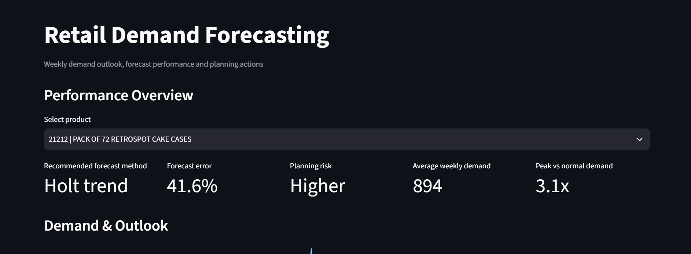

# Retail Demand Forecasting

Python | statsmodels | Streamlit | 1,067,371 raw transactions | 5 SKUs forecast weekly

A demand-planning workflow that cleans retail transactions, selects forecastable products, compares models on unseen weeks and presents product-level planning guidance in a Streamlit app.

[Open the Streamlit app](https://demand-forecasting-retail-kg5mko7xnqxbjmzgcffz5y.streamlit.app/)

## Project Background

Inventory and planning teams need weekly product demand estimates to inform stock reviews. The [UCI Online Retail II dataset](https://archive.ics.uci.edu/dataset/502/online+retail+ii) contains 1,067,371 raw transaction rows across two annual worksheets. Cancellations, stock adjustments, postage and fee lines, zero-price records, duplicate rows and a duplicated December 2010 overlap make raw sales lines unsuitable as a direct demand signal.

Intended stakeholders: Demand planners, inventory managers and commercial teams.

Decision context: Choose a defensible forecasting method for each screened SKU, identify where historical forecasts are less reliable, and separate routine planning accuracy from occasional peak-demand risk. Weighted mean absolute percentage error (WMAPE) is the primary model-selection measure.

## Business Questions

1. Which transaction records represent genuine merchandise demand, and what time grain is suitable for forecasting?
2. Which products have sufficient history and regularity to support a weekly forecast?
3. Which of five candidate methods performs best for each product on a time-based test period?
4. Where do forecast error and demand spikes create different inventory risks?
5. How can planners review model recommendations and product-specific actions without working through notebooks?

## Data Structure & Initial Checks

The source workbook contains invoice number, StockCode, description, quantity, invoice date, unit price, Customer ID and country. Cleaning removes exact duplicates and the duplicated December 2010 worksheet overlap; excludes cancellations, returns, stock adjustments, zero or negative prices and non-merchandise codes; and removes positive sales fully reversed by same-day cancellations. It retains missing Customer IDs when product, quantity and date support demand analysis, as well as legitimate high-volume orders.

The result is 1,004,262 cleaned transaction rows representing positive merchandise-order demand. Demand is then aggregated weekly by product. Screening limits modelling to five high-volume SKUs with at least 52 weeks of history, demand in at least 70% of available weeks and moderate volatility. This screen prioritises tractable products; excluded SKUs are not proven unforecastable.

The [data-understanding notebook](Notebooks/01_data_understanding.ipynb) documents cleaning and the [exploratory notebook](Notebooks/02_exploratory_analysis.ipynb) documents aggregation, seasonality, trading gaps and product screening.

## Executive Summary

- Model choice varies by SKU. Exponential smoothing performed best for 84879 and 84077; Holt trend for 21212 and 85099B; and the naive baseline for 85123A. A single default method would have missed these differences.
- The best test-period WMAPE ranged from 26.62% for 84879 to 42.05% for 85123A. These errors support different review frequencies and planning caution by product.
- 84879 and 84077 combined the two lowest WMAPE values with the highest peak-to-average demand ratios. Average forecast accuracy therefore does not remove the need to plan for occasional demand spikes.



## Insights Deep Dive

### Demand preparation and calendar

Daily demand was highly volatile; weekly aggregation produced a clearer signal for the five selected products. Demand strengthens through autumn and the pre-Christmas period. Some Christmas and New Year weeks have reduced or zero trading, which should be treated as observed calendar behaviour rather than automatically filled as missing data. Activity spans a broad product range, and the United Kingdom accounts for most total demand.

### Model performance by product

Five methods were compared on a 12-week time-based hold-out: naive baseline, four-week moving average, seasonal naive, simple exponential smoothing and Holt's trend method. The saved [model summary](Data/Processed/model_summary.csv) reports these winning results:

| StockCode | Best model | Test WMAPE |
|---|---|---:|
| 84879 | Exponential smoothing | 26.62% |
| 84077 | Exponential smoothing | 38.40% |
| 21212 | Holt trend | 41.55% |
| 85099B | Holt trend | 41.75% |
| 85123A | Naive baseline | 42.05% |

The naive baseline outperformed the more complex options for 85123A, showing why it belongs in every product-level comparison. Mean absolute error (MAE) and root mean squared error (RMSE) were also calculated. WMAPE was used for selection because it allows relative error comparisons across products with different demand volumes.

### Accuracy versus peak-demand risk

84879 and 84077 had the two lowest WMAPE values but the highest peak-to-average demand ratios. Their typical weeks are relatively easier to forecast, yet unusual high-demand weeks can still strain inventory. A point forecast and its average test error should therefore be reviewed alongside peak-demand history and service requirements.

### Planner-facing delivery

The [Streamlit application](Streamlit_App/app.py) lets users select any of the five forecast products, see the recommended method and error, review historical weekly demand, compare actuals with forecasts and methods with one another, and read product-specific planning actions. The screenshot above shows the interface.

## Recommendations

These actions use back-test evidence to guide review and testing. Stock decisions still need lead times, service targets, carrying costs and operational judgement.

| Priority | Recommendation and evidence | Suggested owner | Expected impact | Metric to track |
|---|---|---|---|---|
| 1 | Set review frequency by product-level forecast error. The best WMAPE ranges from 26.62% to 42.05%; higher-error SKUs need closer review and more cautious use of point forecasts. | Demand Planning and Inventory Management | Focus planner attention where forecast uncertainty is greatest. | Rolling WMAPE and bias by SKU; stockouts and excess stock |
| 2 | Test additional stock protection for spike-prone 84879 and 84077. Both have low average test error but high peak-to-average demand ratios. Size any buffer against service targets and replenishment lead times. | Inventory Management | Reduce exposure to occasional surges without setting a blanket buffer. | Peak-week service level; stockouts; inventory cover and excess stock |
| 3 | Review seasonal stock plans before September. Demand strengthens through September–November and the pre-Christmas period. | Demand Planning and Commercial | Enter the peak season with time to adjust purchasing and replenishment. | Seasonal forecast error; availability; stock cover during peak weeks |
| 4 | Keep model selection at product level. The winning method differs across the five SKUs, including a naive baseline winner. Re-run comparisons as new products enter scope and new observations arrive. | Forecasting or Analytics | Maintain a method suited to each product rather than relying on one default. | Hold-out or rolling WMAPE by SKU and model; forecast bias |

Next development steps are to test additional methods and external drivers such as promotions, holidays and pricing; expand coverage beyond five SKUs; introduce rolling validation and automated refreshes; and track bias and service-level outcomes.

## Assumptions & Caveats

- These models use historical transaction demand. Promotions, price changes and holiday effects are not included as explicit drivers.
- Only five screened products were forecast. Their model rankings and error rates do not generalise to the full catalogue.
- Sparse and highly volatile products were excluded by the screening rules. They remain unforecast in this project, not inherently unforecastable.
- Missing Customer IDs were retained where demand fields were usable, so this workflow does not support customer-level conclusions.
- WMAPE summarises average relative test error and does not fully describe rare peaks, forecast bias or inventory service outcomes.
- A 12-week hold-out provides a time-ordered comparison for this project. Performance may change in other seasons or after market conditions shift; rolling evaluation is a proposed next step.
- Christmas and New Year trading gaps reflect the observed calendar. Future deployments should handle closures and trading schedules explicitly.

## Tools & Technical Approach

Python, pandas, NumPy, Matplotlib, statsmodels, Jupyter Notebook and Streamlit support the workflow; Git and GitHub provide version control and hosting.

1. [Data understanding and cleaning](Notebooks/01_data_understanding.ipynb) profiles the workbook, resolves duplicate rows and worksheet overlap, and isolates positive merchandise demand.
2. [Exploratory analysis](Notebooks/02_exploratory_analysis.ipynb) compares daily and weekly patterns, investigates seasonality and trading gaps, and screens products.
3. [Forecasting models](Notebooks/03_forecasting_models.ipynb) compares five methods per product on a 12-week time-based test period using MAE, RMSE and WMAPE.
4. [Business insights and recommendations](Notebooks/04_business_insights_and_recommendations.ipynb) translates error and demand patterns into planning guidance.
5. [Streamlit app](Streamlit_App/app.py) presents the selected products and results for planner review.

## Repository Structure

```text
demand-forecasting-retail/
├── Data/
│   ├── Raw/
│   │   └── online_retail_II.xlsx
│   ├── Cleaned/
│   │   └── retail_transactions_clean.csv
│   └── Processed/
│       ├── weekly_forecast_data.csv
│       ├── model_summary.csv
│       └── final_forecast_results.csv
├── Notebooks/
│   ├── 01_data_understanding.ipynb
│   ├── 02_exploratory_analysis.ipynb
│   ├── 03_forecasting_models.ipynb
│   └── 04_business_insights_and_recommendations.ipynb
├── Streamlit_App/
│   ├── app.py
│   └── data/
├── images/
│   └── streamlit_dashboard.png
├── requirements.txt
├── README.md
└── .gitignore
```
